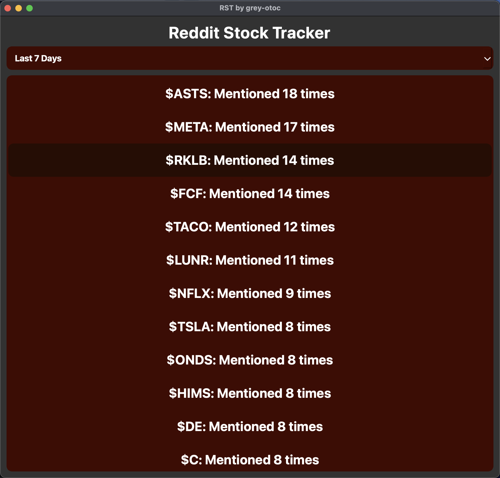
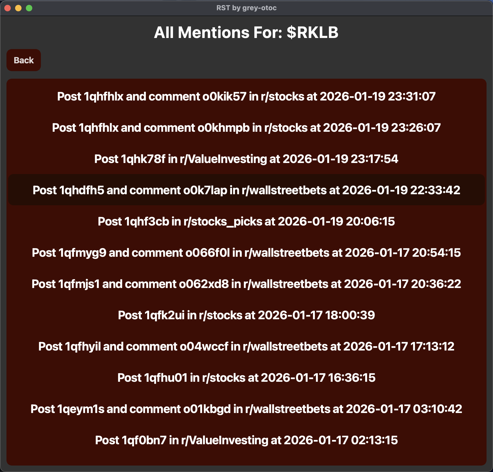

# Reddit-Stock-Tracker

## Description
A local, end-to-end Python application that continuously collects and analyses Reddit post/comment data to identify frequently mentioned stock tickers. The system scrapes configurable subreddits, applies custom filtering logic to greatly reduce false positives, stores structured results in a local SQL database, enables scheduled background processing to keep scraping running continuously, and provides a PySide6 GUI for visualisation of which tickers had the most mentions in the user-selected timeframe.

## Features
- Comprehensive scraping and extraction logic to greatly reduce false positive ticker mentions
- Easily configured to include whichever Subreddits desired
- Utilises a reputable ticker list updated daily using Nasdaq's own data, including Nasdaq, NYSE, and AMEX stock exchanges
- With Reddit greatly restricting unauthenticated API access, this project retrieves data via publicly accessible JSON endpoints rather than OAuth-based APIs
- Provides scheduling to keep scraper, extraction, and ticker list running continuously with one simple terminal command
- All ticker mentions are recorded in a local SQL database with relevant information (post id, comment id, ticker symbol, timestamp, and subreddit)
- Scraper utilises a sliding window post and comment cache to only compare the n newest posts/comments, keeping the database as lightweight as possible
- Provides a PySide6 GUI to visualise the most mentioned tickers in a timeframe of the user's choosing

## Tech Stack
### Frontend
- **PySide6** — Qt-based GUI for interactive data visualisation

### Backend
- **Python** — Core application logic and orchestration
- **SQLite3** — Persistent storage for ticker mentions, relevant post/comment data, and sliding-window caches
- **APScheduler** — Library for background task scheduling and timed execution
- **Requests** — Library providing an HTTP client for controlled, rate-aware data ingestion

## Setup and Use
### Dependencies

- APScheduler
- PySide6
- Python >= 3.11
- requests
- tzlocal

All dependencies are listed in `requirements.txt`.  
Manual installation is not required.

### 1. Clone the repository
```bash
git clone https://github.com/YOUR_USERNAME/reddit-stock-tracker.git
cd YOUR_FILE_PATH/reddit-stock-tracker
```

### 2. Setup Python Virtual Environment
```bash
# Create virtual environment
python3 -m venv venv

# Activate it
# Windows:
venv\Scripts\activate
# Mac/Linux:
source venv/bin/activate
```

### 3. Install Dependencies
```bash
pip install -r requirements.txt
```

### 4. Select Your Desired Subreddits
Alter this constant in main.py to contain whichever subreddits you'd like.
```python
SUBREDDITS = [
    "stocks", "wallstreetbets", "stocks_picks", "ValueInvesting", 
    "stockmarket", "stockstobuytoday"
]
```

### 5. Start the App's Scheduler
```bash
cd src
python3 main.py
```

On first launch, the scheduler will immediately update the ticker list and scrape, extract, and record all mentions from the chosen Subreddits. After the initial run, the update_ticker_list function will run every 24 hours and the execute_scrape function will run every 30 minutes. This can be changed by altering the TICKER_LIST_UPDATER_DELAY and SCRAPER_EXTRACTOR_DELAY constants in main.py:

```python
scheduler.add_job(
    update_ticker_list, 
    'interval', 
    days=TICKER_LIST_UPDATER_DELAY, 
    next_run_time=datetime.now(),
    id='ticker_update',
    replace_existing=True
)

scheduler.add_job(
    execute_scrape, 
    'interval', 
    minutes=SCRAPER_EXTRACTOR_DELAY, 
    next_run_time=datetime.now(),
    id='subreddit_scrape',
    replace_existing=True
)
```

The scheduler will run indefinitely unless a fatal error occurs, the terminal window closes, the computer shuts down, or the user uses a keyboard interrupt (CTRL/CMD + C).

### 6. Display the GUI
In a new terminal window (to keep the scheduler running if desired) within the src folder, run:
```bash
python3 dashboard_ui.py
```

### 7. UI Preview
#### List of Tickers Sorted by Mention Count and Filtered by Timeframe
<p align="left">
    
</p>

#### List of Mentions for Chosen Ticker
<p align="left">
    
</p>

## Best Practice Usage
### Avoiding Rate Limiting
The amount of posts and comments collected is easily altered by changing these constants in main.py:
```python
POSTS_TO_COLLECT = 5
COMMENTS_TO_COLLECT = 10
```
And, as noted above, the frequency with which the scheduler executes a scrape is easily altered as well. However, caution should be taken to avoid being rate-limited by Reddit. Although there is not a clearly defined rate limit for public reddit requests, testing showed that remaining under 50-60 requests per minute is ideal. For clarity, with POSTS_TO_COLLECT set to 5 and len(SUBREDDITS) equalling 6, we are already at 36 requests (1 fetch for posts per subreddit (1 * 6) + 1 fetch for comments per post ((1 * 5) * 6)). This leaves some room for expansion, but not by much. Keep this in mind.

### User Agent Importance
In addition to keeping requests at a reasonable amount/pace, user agent headers are also essential to avoiding even stricter throttling. Ensure that this line in in Scraper.py:
```python
HEADERS = {"User-Agent": "reddit-stock-tracker/1.0 (by u/YOUR_USERNAME)"}
```
and this line in ticker_list_controller.py:
```python
HEADERS = {
    "User-Agent": "Mozilla/5.0 (Macintosh; Intel Mac OS X 10_15_7) AppleWebKit/537.36 (KHTML, like Gecko) Chrome/119.0.0.0 Safari/537.36",
    "Accept": "application/json, text/plain, */*",
    "Accept-Language": "en-US,en;q=0.9",
    "Origin": "https://www.nasdaq.com",
    "Referer": "https://www.nasdaq.com/"
}
```
are kept in the scripts.

## Future Improvements

-  Adding further information to ticker detail views where the user can see relevant data like the current stock price, percent change of n time, and a graph of this change over n time.

## Contributing

This is a project made for personal interest and learning, but feel free to fork and experiment! Pull requests are welcome.

## License

MIT License - Use, modify, and distribute this software however you'd like.

## Acknowledgments

- Utilises publicly available data from: https://www.reddit.com/
- Utilises publicly available data from: https://www.nasdaq.com/market-activity/stocks/screener
- Utilised [SCOWL and (Friends)'](http://wordlist.aspell.net/) wordlist creator to generate the base word list used for filtering common word tickers

## Links
**Repository:** [reddit-stock-tracker](https://github.com/grey-otoc/reddit-stock-tracker)

## Disclaimer
This project is intended for educational and personal use only.  
Scraping Reddit may violate Reddit’s Terms of Service. Users are responsible for ensuring their own compliance with Reddit’s policies and applicable laws.
